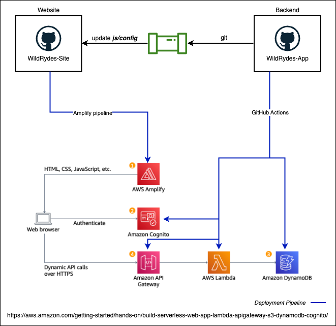

# wildrydes-app
This repository contains the AWS resources for the backend of the (WildRydes-Site)[https://github.com/notonprem/wildrydes-site]

Automation of the deployment of Serverless Web Application project by AWS.
Link to project (here)[https://aws.amazon.com/getting-started/hands-on/build-serverless-web-app-lambda-apigateway-s3-dynamodb-cognito/]

## Architecture

## Components
1. GitHub repository
2. GitHub Actions
3. AWS account
